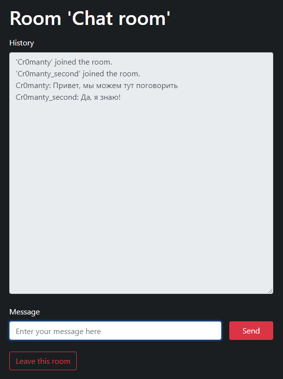

# Chat app
### Technology used
* **Flask** - used for server side
* **Socket.IO** - used for one-to-one connections

## Project files
Program consists of 7 files:

### Python files
* **app.py** - init Flask and Socket.IO variable
* **main.py** - set socket namespace and start server
* **models.py** - describes login form class
* **views.py** - render html templates for site and describes socket class

### HTML files
* **base.html** - used as a site template, contains a navigation bar, socket variable and socket disconnect function
* **index.html** - extends *base.html*, contains login form
* **chat.html** - extends *base.html*, contains chat form and JS function  

## How it works

## To start the chat:

1. Run main.py on your computer.
The server will be running at 'http://localhost:5000'.
After starting the server go to the address and you will see this window.

2. Enter username and room to connect to chat.

3. Open new tab with same address (http://localhost:5000)
and enter the name of the second user and the name of the room.
**The name of the room must match the name of the room of the first user for communication.**

4. Now you can send and read messages.

5. After someone leaves the chat, all its participants will be notified. 
If this was done through the "Leave this room" button, then disconnection will occur instantly.
